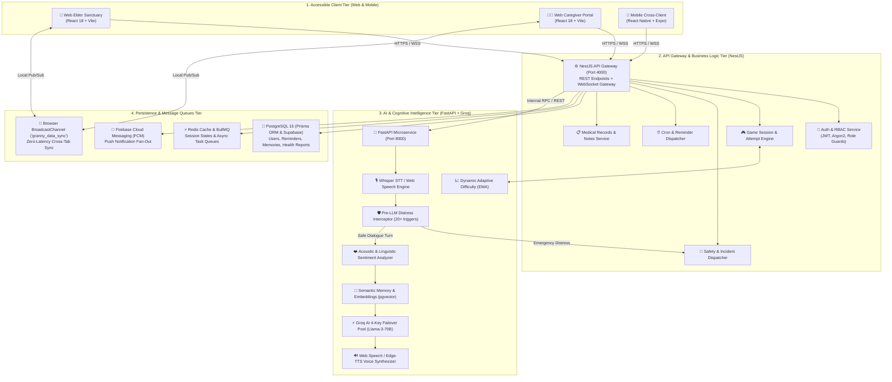
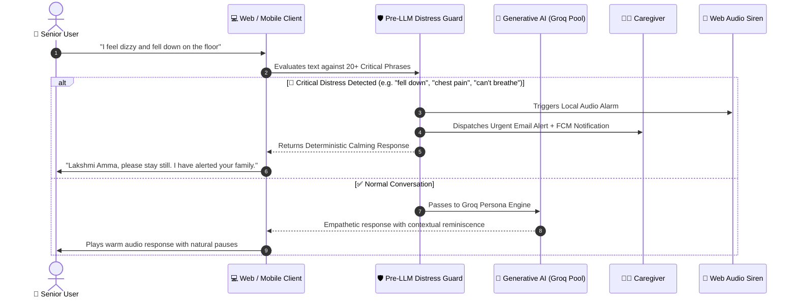
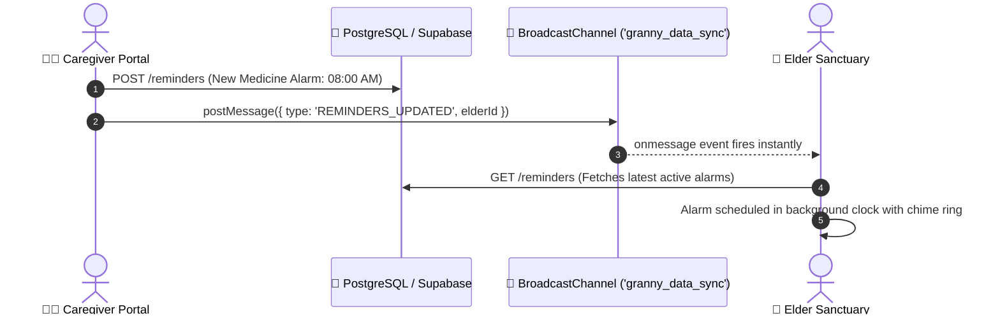
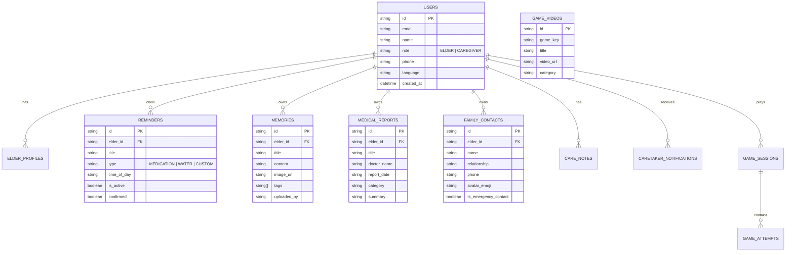

<div align="center">

# 👵 Granny (தாத்தா & பாட்டி)
### Enterprise-Grade AI Cognitive Gaming, Voice Companion & Health Ecosystem for the Elderly

[](https://www.typescriptlang.org/)
[](https://reactjs.org/)
[](https://expo.dev/)
[](https://nestjs.com/)
[](https://fastapi.tiangolo.com/)
[](https://www.postgresql.org/)
[](https://www.prisma.io/)
[](https://redis.io/)
[](https://www.docker.com/)
[](LICENSE)

<p align="center">
  <b>“Don’t make the elderly adapt to technology. Make technology adapt to the elderly.”</b><br/>
  <i>A unified, voice-first digital sanctuary connecting an interconnected 20-game nostalgic cognitive world with dynamic AI question generation, semantic life-story reminiscence, daily routine support, and instant caregiver health synchronization.</i>
</p>

[Executive Summary](#-executive-summary) •
[High-Level Architecture (HLD)](#-high-level-design-hld-architecture) •
[Subsystem Deep Dives (LLD)](#-subsystem-deep-dives--low-level-design) •
[The 20-Game Cognitive Engine](#-the-20-game-cognitive-library) •
[Real-Time Synchronization Protocol](#-real-time-cross-portal-synchronization) •
[Database Architecture](#-database-schema--data-models) •
[API Specifications](#-api-specifications--contracts) •
[Project Topology](#-project-topology) •
[Deployment & Setup](#-getting-started--deployment) •
[Compliance & Accessibility](#-safety-ethics--accessibility-standards) •
[Team & License](#-engineering--product-team)

---

</div>

## 📌 Executive Summary

Over **138 million elderly individuals** experience cognitive decline, social isolation, and digital exclusion. Conventional cognitive training applications aggravate these challenges with generic geometric puzzles, tiny touch targets, and punitive countdowns that trigger performance anxiety.

**Granny** solves this by establishing a **voice-first, culturally anchored digital sanctuary** for seniors paired with an **oversight portal for caregivers**. The platform transforms familiar childhood memories, traditional sports, and personal family photographs into dynamic cognitive exercises while providing real-time health monitoring, medication alerts, and pre-LLM distress intervention.

---

## 🏛️ High-Level Design (HLD) Architecture

The platform is architected as a distributed, decoupled multi-tier system designed for fault tolerance, ultra-low voice latency (<800ms), and real-time cross-client synchronization.



---

## 🔬 Subsystem Deep Dives (Low-Level Design)

### 1. Asha Voice AI & 4-Key Failover Pool
- **Asha Voice Engine**: A culturally tuned persona engineered to converse in patient, respectful Tamil and English.
- **4-Key Failover Groq Pool**: High-availability AI pipeline utilizing round-robin load distribution across four independent Groq API key slots (`slot_1` to `slot_4`) with automatic failover if rate limits or quota boundaries are met.
- **Dynamic Memory Extraction**: Extracted personal entities (e.g., hometown, favorite recipes, family anecdotes) are parsed from dialogues and automatically persisted to the memory vault.

### 2. Pre-LLM Emergency Safety Guardrails
To prevent hallucinations and guarantee instant emergency response, all spoken inputs pass through a deterministic pre-LLM regex interceptor before reaching any generative model.



### 3. Dynamic Exponential Moving Average (EMA) Difficulty Engine
The cognitive difficulty engine adjusts question complexity dynamically based on performance metrics without ever displaying a "Game Over" screen:

$$\text{EMA}_t = \alpha \cdot \text{Score}_t + (1 - \alpha) \cdot \text{EMA}_{t-1}$$

- **Latency Softening**: If response latency exceeds the target threshold ($\tau > 12s$), distractors are automatically reduced from 4 choices to 2 choices, and observation timers are lengthened by $+5s$.
- **Zero-Punitive Design**: Failed attempts generate positive reinforcement hints and nostalgic clues rather than decreasing player lives.

---

## 🎮 The 20-Game Cognitive Library

All games implement the standard `CognitiveGame` TypeScript contract:

```typescript
export interface CognitiveGame {
  key: string;
  title: string;
  title_ta?: string;
  icon: string;
  category: 'outdoor' | 'indoor' | 'cinema';
  description: string;
  description_ta?: string;
  primarySkills: string[];
  startSession(userId: string, difficulty: DifficultyParams): SessionState;
  submitAttempt(sessionState: SessionState, response: string): AttemptResult;
}
```

| # | Game Title | Category | Cognitive Domain | Heritage Theme & Mechanics |
| :-: | :--- | :--- | :--- | :--- |
| **1** | **Gilli Danda (கிட்டிப்புல்)** | Outdoor | Spatial & Reflex Recall | Traditional street game recalling wooden peg striking trajectories. |
| **2** | **Kabaddi (சடுகுடு / கபடி)** | Outdoor | Working Memory | High-energy breath control, raiding tactics, and team positions. |
| **3** | **Kanche / Marbles (கோலி குண்டு)** | Outdoor | Visual & Motor Precision | Circle target recall and precision thumb strike techniques. |
| **4** | **Kite Flying (பட்டம் விடுதல்)** | Outdoor | Spatial Orientation | Terrace wind estimation, colorful diamond kite identification. |
| **5** | **Street Cricket (தெரு கிரிக்கெட்)** | Outdoor | Episodic Memory | Box-cricket rules, gully fielding positions, and scoring rules. |
| **6** | **Nondi / Hopscotch (நொண்டி)** | Outdoor | Motor Sequence Recall | Numbered grid stone throwing, hop patterns, and balance recall. |
| **7** | **Uriyadi (உறியடி திருவிழா)** | Outdoor | Auditory Orientation | Blindfold pot breaking, village festival rhythm, and voice cues. |
| **8** | **Tyre Oattam (டயர் ஓட்டம்)** | Outdoor | Motor Rhythm Recall | Guiding bicycle tyres with sticks across village lanes. |
| **9** | **Kho-Kho (கோ-கோ)** | Outdoor | Executive Processing | Sitting direction switching, chase patterns, and team reflexes. |
| **10** | **Skipping Rope (கயிறு தாண்டுதல்)** | Outdoor | Rhythm & Sequence | Traditional counting rhymes, dual-rope rhythm, and jump sync. |
| **11** | **Pallanguzhi (பல்லாங்குழி)** | Indoor | Arithmetic & Strategy | 14-cup wooden board cowrie shell distribution and counting. |
| **12** | **Thaayam (தாயம்)** | Indoor | Strategic Planning | Brass dice rolling, token movements, and inner square navigation. |
| **13** | **Paramapadham (பரமபதம்)** | Indoor | Visual Tracking | Traditional Snakes & Ladders navigating virtues and vices. |
| **14** | **Seettu Vilayattu (சீட்டு விளையாட்டு)** | Indoor | Pattern Recognition | Traditional 52-card suits, 28/56 point counting, and memory tracking. |
| **15** | **Carrom (கேரம்)** | Indoor | Geometric Estimation | Striker pocketing, carrom men placement, and coin combinations. |
| **16** | **Movie Poster Recall (பழைய சினிமா)** | Cinema | Long-Term Episodic | Vintage movie posters, classic releases, and famous director pairings. |
| **17** | **Ilaiyaraaja Melodies (இளையராஜா பாடல்)** | Cinema | Auditory Melodic | Retro background score snippets, lyric lines, and raaga recognition. |
| **18** | **Actor & Actress Match (நடிகர் ஜோடி)** | Cinema | Associative Memory | Classic golden era cinema co-stars and evergreen film pairings. |
| **19** | **Cinema Ticket Booking (டிக்கெட் கவுண்டர்)** | Cinema | Working Memory | Balcony seat pricing, counter cues, and theater showtimes. |
| **20** | **Oliyum Oliyum (ஒளியும் ஒலியும்)** | Cinema | Visual & Melodic Recall | Friday evening Doordarshan song clips and movie identification. |

---

## ⚡ Real-Time Cross-Portal Synchronization

When a caregiver sets a medicine alarm, uploads a memory, or adds a medical report in the Caregiver Portal, the updates propagate immediately to the Elder Portal:



- **BroadcastChannel (`granny_data_sync`)**: Sub-millisecond cross-tab synchronization.
- **Window Event Dispatcher**: Triggers immediate component re-renders in the active view.
- **Role Switching ID Integrity**: Guarantees that switching between Caregiver and Elder spaces maintains consistent `elderId` binding.

---

## 🗄️ Database Schema & Data Models

The relational database architecture is managed via Prisma ORM and Supabase PostgreSQL:



---

## 📡 API Specifications & Contracts

### 🔐 Authentication Endpoints
- `POST /api/v1/auth/signup`: Registers a new Elder or Caregiver account.
- `POST /api/v1/auth/signin`: Authenticates via username, email, or phone.
- `POST /api/v1/auth/signout`: Terminates active session token.

### ⏰ Reminders & Health
- `GET /api/v1/reminders/:elderId`: Retrieves active daily medicine & water alarms.
- `POST /api/v1/reminders`: Creates an alarm and emits real-time sync notification.
- `PATCH /api/v1/reminders/:id/toggle`: Marks reminder as confirmed with timestamp.
- `DELETE /api/v1/reminders/:id`: Deletes scheduled reminder.

### 📸 Memory Vault & Reminiscence
- `GET /api/v1/memories/:elderId`: Retrieves photo album and story entries.
- `POST /api/v1/memories`: Uploads family photo and story tags.
- `GET /api/v1/games/videos`: Returns the 10 heritage game video URLs.

### 🚨 Safety & Incidents
- `POST /api/v1/safety/distress`: Logs critical emergency incident and triggers fan-out alert.
- `GET /api/v1/notifications/:elderId`: Returns in-app caregiver alert feed.

---

## 📁 Project Topology

```text
Granny/
├── apps/
│   ├── web/                     # Senior & Caregiver React 18 + Vite Web Application
│   │   ├── src/
│   │   │   ├── components/
│   │   │   │   └── navigation/  # AppShell (Header/Sidebar) & ProtectedRoute guards
│   │   │   ├── contexts/        # AppContext (Shared state, auth & real-time sync)
│   │   │   ├── features/games/  # 20 cognitive game engines & types
│   │   │   ├── pages/           # Modularized declarative page components
│   │   │   │   ├── Home/        # Elder Home Sanctuary (/home)
│   │   │   │   ├── Companion/   # Asha Voice AI Companion (/companion)
│   │   │   │   ├── Games/       # 20 AI Games Library & Play Arena (/games, /games/play)
│   │   │   │   ├── Family/      # 1-Tap Calling Circle (/family)
│   │   │   │   ├── Health/      # Medicine & Water Reminders (/health)
│   │   │   │   ├── Memory/      # Photo Vault & 10 Heritage Videos (/memory)
│   │   │   │   ├── Theatre/     # Life-Story Memory Theatre (/theatre)
│   │   │   │   ├── Settings/    # Bilingual, Audio Chime & Link Code Settings (/settings)
│   │   │   │   ├── Dashboard/   # Caregiver Cognitive Health Overview (/dashboard)
│   │   │   │   ├── Caretaker/   # Alarms, Medical, Memories, Contacts, Guide, Link (/caretaker/*)
│   │   │   │   ├── LandingPage.tsx # Public Hero & Demo Showcase (/)
│   │   │   │   ├── AuthPage.tsx    # Sign-in & Registration (/login, /register)
│   │   │   │   └── NotFoundPage.tsx# 404 Route Fallback (*)
│   │   │   ├── services/        # 4-Key Failover Groq AI & Supabase DB clients
│   │   │   ├── utils/           # Web Audio API chimes (Temple bell, sirens, alerts)
│   │   │   ├── store/           # Local & session state persistence
│   │   │   └── App.tsx          # Declarative React Router v6 setup
│   │   └── package.json
│   │
│   └── mobile/                  # React Native / Expo Handheld Application
│       ├── src/
│       │   ├── screens/         # Large touch target mobile screens
│       │   ├── features/        # Voice, games, reminders, caregiver views
│       │   └── navigation/      # Stack & Tab navigators
│       └── package.json
│
├── backend/                     # Core NestJS Application
│   ├── src/
│   │   ├── modules/
│   │   │   ├── auth/            # Authentication & Role-Based Access (Elder / Caregiver)
│   │   │   ├── games/           # Game session tracking, score logging & metrics
│   │   │   ├── memory/          # Life-story & anecdote management
│   │   │   ├── safety/          # Incident logging, severity ratings & alerts
│   │   │   ├── reminders/       # Medication, hydration, & routine cron jobs
│   │   │   ├── family/          # Caregiver circles & granular consent management
│   │   │   └── conversations/   # Chat logs & emotional trajectory records
│   │   ├── database/            # Prisma ORM client & lifecycle module
│   │   └── main.ts              # NestJS server bootstrapper (Port 4000)
│   └── package.json
│
├── ai-services/                 # Python FastAPI AI Microservice
│   ├── app/
│   │   ├── api/                 # Endpoint routers (voice, memory, conversation, safety)
│   │   ├── services/
│   │   │   ├── conversation/    # LLM dialog management & persona injection
│   │   │   ├── coplay/          # Asymmetric Family Co-Play Quests
│   │   │   ├── emotion/         # Acoustic & linguistic sentiment analysis
│   │   │   ├── games/           # Centralized EMA Adaptive Difficulty Engine
│   │   │   ├── interventions/   # 1-3 minute context-aware micro-doses
│   │   │   ├── memory/          # Vector embedding & semantic recall
│   │   │   ├── safety/          # Distress phrase detector (20+ triggers)
│   │   │   ├── theatre/         # Life-Story Memory Theatre interactive scenes
│   │   │   └── voice/           # Whisper STT & low-latency TTS pipelines
│   │   └── main.py              # FastAPI application initialization (Port 8000)
│   ├── tests/                   # AI unit & pipeline evaluation tests
│   └── requirements.txt
│
├── database/                    # Database Schemas & Migrations
│   ├── prisma/
│   │   └── schema.prisma        # Complete data model (10 core relational models)
│   └── seed/
│       └── seed.ts              # Seed script with demo elders, caregivers & games
│
├── packages/                    # Shared Monorepo Packages
│   ├── types/                   # Cross-app TypeScript domain models
│   └── api-client/              # Universal typed API SDK for Web & Mobile
│
├── docs/                        # System Architecture & Technical Specifications
│   ├── architecture/            # Architectural blueprints
│   ├── api/                     # REST & WebSocket API documentation
│   └── user-flows/              # Accessible UX interaction maps
│
├── docker-compose.yml           # Unified orchestration file (Postgres, Redis, Backend, AI)
├── .env.example                 # Comprehensive environment variable template
└── package.json                 # Monorepo root workspace configuration
```

---

## 🚀 Getting Started & Deployment

### 📋 Prerequisites

- **Node.js**: `v18.x` or `v20.x`
- **Python**: `v3.10` or `v3.11`
- **Docker & Docker Compose** (Optional, for 1-command launch)

---

### Option A: 1-Click Launch with Docker (Production Ready)

```bash
# 1. Clone repository
git clone https://github.com/yukesh4349/Granny.git
cd Granny

# 2. Configure environment
cp .env.example .env

# 3. Spin up all containers
docker-compose up --build -d
```

Access the web portal at **`http://localhost:5173`**.

---

### Option B: Local Step-by-Step Setup

#### 1. Install Monorepo Dependencies
```bash
git clone https://github.com/yukesh4349/Granny.git
cd Granny
npm install
```

#### 2. Configure Environment Variables
```bash
cp .env.example .env
```

#### 3. Setup Python AI Microservice
```bash
cd ai-services
python -m venv venv

# Windows:
venv\Scripts\activate
# Linux/macOS: source venv/bin/activate

pip install -r requirements.txt
cd ..
```

#### 4. Run Database Migrations & Seed
```bash
npx prisma migrate dev --schema=database/prisma/schema.prisma
npx ts-node database/seed/seed.ts
```

#### 5. Launch Development Services
```bash
# Terminal 1: NestJS Backend (Port 4000)
npm run dev:backend

# Terminal 2: FastAPI AI Service (Port 8000)
cd ai-services && uvicorn app.main:app --reload --port 8000

# Terminal 3: Web Portal (Port 5173)
npm run dev:web

# Terminal 4: Mobile App (Expo)
npm run dev:mobile
```

---

## 🌐 Service Ports & Access Points

| Service | Port | Endpoint URL | Documentation |
| :--- | :--- | :--- | :--- |
| **Web Portal** | `5173` | `http://localhost:5173` | Senior & Caregiver dashboard |
| **Backend Gateway** | `4000` | `http://localhost:4000` | REST API & WebSockets |
| **AI Microservice** | `8000` | `http://localhost:8000` | `http://localhost:8000/docs` (Swagger UI) |
| **PostgreSQL Database** | `5432` | `localhost:5432` | Prisma Studio via `npx prisma studio` |

---

## 🛡️ Safety, Ethics & Accessibility Standards

- [x] **Non-Diagnostic Policy**: The assistant never provides clinical diagnoses and never alters medication prescriptions.
- [x] **Pre-LLM Distress Interception**: Validated against 20+ acute distress triggers (*"I fell down"*, *"I can't breathe"*).
- [x] **WCAG 2.1 AAA Accessibility**: Minimum 48px–64px touch targets, high-contrast modes, large scalable typography (20px+).
- [x] **Consent-Driven Access**: Granular caregiver visibility with revocable elder permissions.
- [x] **Zero Dark Patterns**: No streak penalties, no guilt notifications, and no infinite scroll mechanics.
- [x] **One-Tap Emergency SOS**: Persistent emergency contact and audio siren controls accessible from all views.

---

## 👥 Engineering & Product Team

| Name | Role / Focus Area |
| :--- | :--- |
| **Yukesh Kanna U** | Project Lead & Full-Stack System Architecture |
| **Aadil J M** | Backend Architecture, NestJS & API Gateway Orchestration |
| **Pavan S Kumar** | Database Architecture, Real-Time Safety & Persistence |
| **Agalya** | AI Microservices, Whisper STT & LLM Inference Pipeline |
| **Harini** | Adaptive Difficulty Engine & Cognitive Game Design |
| **Nikidha** | Accessible UX/UI Design & Front-End Engineering |

---

<div align="center">

Developed with ❤️ to empower, protect, and cherish elderly loved ones worldwide.

</div>
