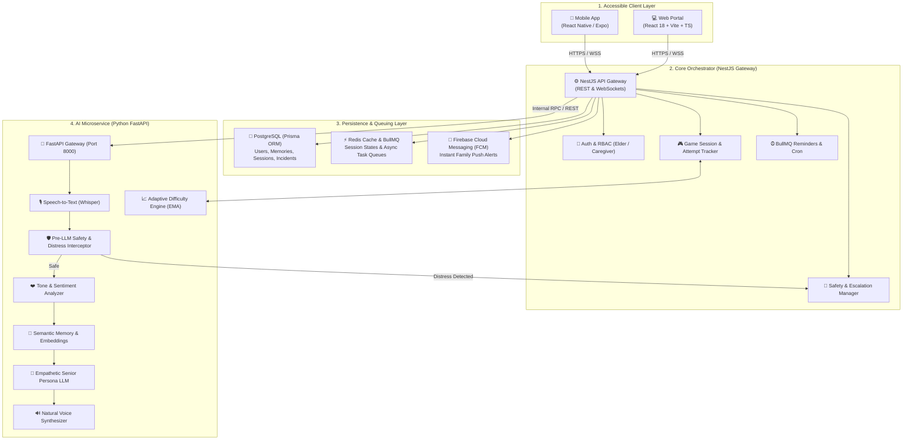
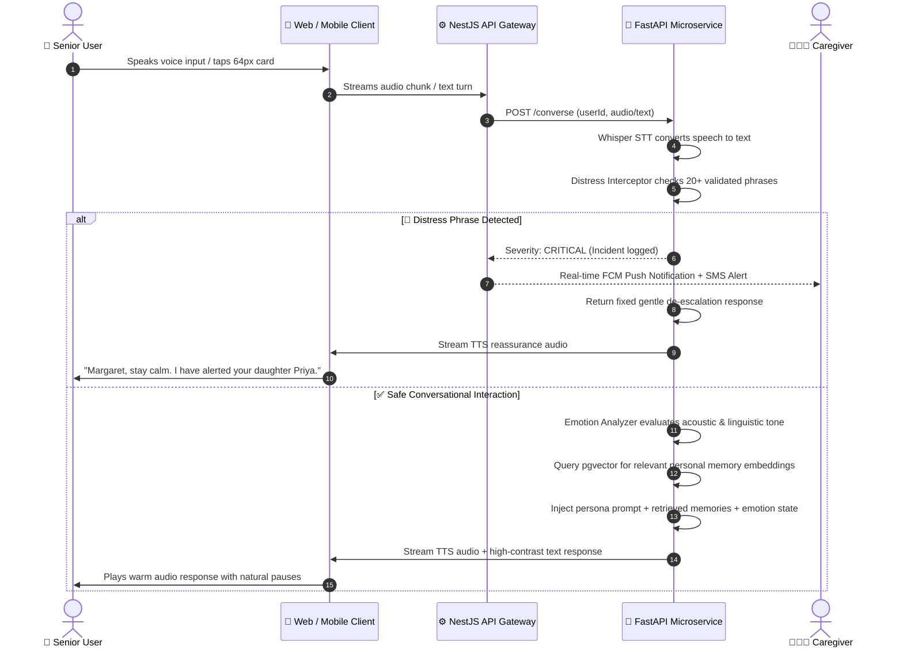

<div align="center">

# 👵 Granny
### AI-Based Cognitive Gaming & Memory Assistance for the Elderly

**Smart India Hackathon (SIH 2026) | Problem Statement ID: `SIH26003`**

[](https://www.typescriptlang.org/)
[](https://reactjs.org/)
[](https://expo.dev/)
[](https://nestjs.com/)
[](https://fastapi.tiangolo.com/)
[](https://www.postgresql.org/)
[](https://www.prisma.io/)
[](https://redis.io/)
[](https://www.docker.com/)
[](LICENSE)

<p align="center">
  <b>“Don’t make the elderly adapt to the technology. Make the technology adapt to the elderly.”</b><br/>
  <i>A unified, voice-first digital companion connecting an interconnected 10-game nostalgic memory world with dynamic adaptive difficulty, semantic life-story reminiscence, daily routine support, and pre-LLM emergency safety guardrails.</i>
</p>

[Live Demo & UI](#-demo--ui-walkthrough) •
[Guiding Principle](#-guiding-principle--problem-statement) •
[Key Features](#-key-features-from-master-blueprint) •
[The 10-Game Memory World](#-the-10-game-connected-memory-world) •
[Architecture](#-system-architecture--contracts) •
[Tech Stack](#-technology-stack) •
[Project Structure](#-project-structure) •
[Quick Start](#-getting-started-quick-start) •
[Roadmap & Checklist](#-phase-wise-roadmap--progress) •
[Safety & Ethics](#-safety-ethics--accessibility-checklist) •
[Team & License](#-team--license)

---

</div>

## 🎯 Guiding Principle & Problem Statement

> **"Elderly individuals are constantly forced to adapt to complex technology — Granny flips the paradigm by adapting the entire technology to the elderly."**

India has over **138 million elderly citizens**, millions of whom face early cognitive decline, loneliness, and digital exclusion. Mainstream brain-training apps aggravate this with stock geometric puzzles, tiny touch targets, and punitive countdowns or streak counters that trigger frustration and anxiety.

**Granny** is built as **one continuous, voice-first world** (Home → Market → Journey → Music → Story → Garden → Album) wrapped around a memory-assistant companion that quietly tracks accuracy, response time, and mistakes, reshaping future interactions around the user without patronizing fail states.

### 💡 The 5 Architectural Pillars (from Granny Master Blueprint)

1. **Identity-Preserving, Not Generic**: Games and dialogues are populated with the elder's own rooms, family photos, and life stories, not stock puzzles.
2. **Voice-First, Not Tap-First**: Speech is the primary interaction mode; oversized 64px touch targets serve as an accessible fallback.
3. **Adaptive by Design**: A single centralized Exponential Moving Average (EMA) difficulty engine governs every game and interaction.
4. **Family-in-the-Loop**: Caregivers receive visibility and asymmetric co-play without turning the app into a surveillance tool.
5. **Safety-First**: Distress phrase interception and gentle de-escalation are architectural foundations, not an afterthought.

---

## 📱 Demo & UI Walkthrough

```text
┌───────────────────────────────────────┬───────────────────────────────────────┬───────────────────────────────────────┐
│     🎙️ Voice-First Elder Screen       │     🧠 Cognitive Memory World         │     🛡️ Caregiver Safety Circle        │
├───────────────────────────────────────┼───────────────────────────────────────┼───────────────────────────────────────┤
│                                       │                                       │                                       │
│   ☀️ Good Morning, Margaret!          │   🎮 Game: "Where Did I Keep It?"     │   🚨 Real-Time Safety Feed            │
│   "It is 8:00 AM. Ready for your      │   Memory Phase: 0:04 remaining        │   [10:15 AM] Distress caught:         │
│    morning medication?"               │                                       │   "I feel dizzy and fell down"        │
│                                       │   ┌───────────────┬───────────────┐   │   Severity: CRITICAL                  │
│   ┌───────────────────────────────┐   │   │  Spectacles   │  Medicine Box │   │   Action: Calming audio played;       │
│   │   🎙️  [TAP TO TALK] (64px)    │   │   │  (Nightstand) │   (Kitchen)   │   │           Family notified via SMS/App │
│   └───────────────────────────────┘   │   └───────────────┴───────────────┘   │                                       │
│                                       │                                       │   📋 Medication Adherence: 100%       │
│   ┌───────────────┬───────────────┐   │   ⚡ Adaptive Engine:                 │   ❤️ Cognitive Vitality: Level 3      │
│   │ 🧩 Play Games │ 📖 Life Story │   │   Latency softening applied;          │   🤝 Consents: Memories & Health      │
│   ├───────────────┼───────────────┤   │   distractor count reduced to 2.      │                                       │
│   │ 💊 Medicine   │ 👨‍👩‍👧 Family    │   │   No fail screens or loss-of-lives!   │   [ Call Elder ]  [ View Records ]    │
│   └───────────────┴───────────────┘   │                                       │                                       │
└───────────────────────────────────────┴───────────────────────────────────────┴───────────────────────────────────────┘
```

### ⏱️ 90-Second Live Demo Flow (SIH Evaluation Script)

| Time | On-Screen Action | Voiceover Focus | Key Judge Wow Factor |
| :--- | :--- | :--- | :--- |
| **00:00 - 00:20** | **Elder Home & Action Cards** | *"Notice the ultra-accessible 64px targets, warm contrast, and hands-free voice interface."* | WCAG AAA standard; zero cognitive friction. |
| **00:20 - 00:45** | **Game World Map → Play Game** | *"Granny is an interconnected memory world. As Margaret memorizes item locations, accuracy & latency are monitored."* | Unified Cognitive Game engine across all 10 games. |
| **00:45 - 01:10** | **Adaptive Difficulty Softening** | *"If Margaret hesitates, the EMA engine quietly softens distractors and extends time on the next item."* | Pedagogy-driven dynamic adjustment; no failure loops. |
| **01:10 - 01:30** | **Voice Companion & Safety Alert** | *"When a senior expresses distress ('I fell down'), the safety guardrail halts dialogue, reassures them, and alerts caregivers."* | Pre-LLM distress phrase interception + FCM alerts. |

---

## 🌟 Key Features (from Master Blueprint)

### 2.1 Core MVP Features

- **Interconnected Cognitive Game World**: 10 nostalgic games linked into an explorable canvas rather than isolated icon grids.
- **Dynamic Adaptive Difficulty Engine**: Centralized Exponential Moving Average (EMA) balancing accuracy, latency, and error types into 5 calibrated difficulty levels.
- **Voice-First Interaction**: Speech-to-text (Whisper) → Intent parsing → Empathetic LLM → Low-latency TTS with conversational cadence and natural pauses.
- **Personal Semantic Memory Assistant**: High-dimensional vector store indexing personal facts, preferences, routines, and life events for natural session-to-session recall.
- **Daily Routine & Medication Reminders**: Scheduled non-diagnostic voice and push reminders with one-tap confirmation logging.
- **Family Circle & Caregiver Dashboard**: Visibility into medication adherence %, 7-day mood trajectories, and game cognitive performance with revocable consent controls.
- **Architectural Safety Guardrails**: Pre-LLM distress phrase detection (20+ triggers) routing immediately to a soothing de-escalation response and real-time family notification.
- **Elderly-First Accessibility**: 48px–64px touch targets, high contrast, large typography, single-column views, and zero dark patterns (no streaks, no guilt-based alerts).

### 2.2 Companion Intelligence Layer

- **Acoustic & Linguistic Emotion Awareness**: Analyzes emotional state (calm, happy, confused, distressed, sad) and modulates response tone and pacing in real time.
- **Conversational Continuity**: Persistent session memory so Granny remembers yesterday’s anecdotes and routines.
- **Voice Recognition per Family Member**: Enrolled voiceprints distinguish callers to personalize greetings (e.g. greeting a grandchild vs caregiver).
- **Multilingual / Regional Speech**: English and Tamil out of the box, with an extensible i18n layer ready for any regional Indian dialect.

### 2.3 Stretch / Proprietary Differentiators (Judge Wow Factors)

- **Life-Story Memory Theatre**: LLM transforms personal family anecdotes into choose-your-own-path interactive reminiscence scenes, scaffolded by cognitive level (MMSE-style).
- **Just-in-Time Micro-Interventions**: 1–3 minute context-aware cognitive micro-doses (post-lunch music recall, morning orientation, evening relaxation).
- **Family Co-Play Memory Quests**: Multi-generational memory quests where the elder acts as the *Chief Storyteller*.
- **Culturally Adaptive Companion**: Content, festival reminders, folk stories, and companion tone adapt to the elder's cultural background.
- **Socially Assistive Robot (SAR) / Avatar Ready**: Same backend contract designed to drive physical robotic or animated avatars in future phases.

---

## 🧠 The 10-Game Connected Memory World

All 10 games implement a single unified TypeScript contract (`CognitiveGame`), ensuring consistent telemetry, dynamic difficulty tuning, and zero redundant code:

```typescript
interface CognitiveGame {
  key: string;
  title: string;
  primarySkills: string[];
  startSession(userId: string, difficulty: DifficultyParams): SessionState;
  getNextItem(sessionState: SessionState): GameItem;
  submitAttempt(sessionState: SessionState, response: string): AttemptResult;
  endSession(sessionState: SessionState): SessionSummary;
}
```

| # | Game Name | Cognitive Domain | Mechanics & Nostalgic Theme |
| :-: | :--- | :--- | :--- |
| **1** | **🏠 Remember My Home** | Spatial + Visual Memory | Place everyday items (keys, glasses, medicine box) in home rooms, hide, and recall positions. |
| **2** | **🛒 Memory Market** | Working Memory + Attention | Remember a traditional shopping list (rice, tea, spices) and identify items in market stalls. |
| **3** | **👤 Name & Face Match** | Recognition + Associative | Match familiar faces (friends, neighbors, family members) to names and relationships. |
| **4** | **🍲 Recipe Recall** | Sequential + Executive | Reconstruct traditional cooking steps in the correct order through drag-and-drop or voice. |
| **5** | **🗺️ Memory Journey** | Episodic + Sequential | A guided walk through landmark locations; recall what was seen and the sequence of stops. |
| **6** | **🎵 Complete the Tune** | Auditory + Melodic Recall | Listen to a nostalgic vintage song snippet and hum or speak the next line of lyrics. |
| **7** | **🔍 Story Detective** | Auditory Comprehension | Listen to a short spoken folk tale or anecdote and answer gentle comprehension questions. |
| **8** | **📦 Where Did I Keep It** | Working + Spatial Recall | Everyday objects placed around the house; delayed recall of drawer and shelf locations. |
| **9** | **🌺 Memory Garden** | Visual + Spatial + Long-Term | Persistent virtual garden where elders plant flowers and test recall of prior placements. |
| **10** | **📸 Memory Album** | Recognition + Episodic | Reminisce over real family photos and recall details (who was there, year, occasion). |

---

## 🏗️ System Architecture & Contracts

Granny follows a modular, decoupled service-oriented architecture designed for independent scaling and future integrations.



### 🔄 Architectural Contract: Pre-LLM Safety & Conversational Loop



---

## 🛠️ Technology Stack

| Domain | Technology / Library | Architectural Role |
| :--- | :--- | :--- |
| **Web Portal** | **React 18, Vite, TypeScript, Tailwind CSS** | Senior-accessible web portal, 64px touch targets, Web Speech API. |
| **Mobile App** | **React Native, Expo, TypeScript** | Cross-platform mobile deployment, native push notifications, offline alarms. |
| **Backend Gateway** | **Node.js, NestJS, TypeScript, WebSockets** | Modular API gateway, ownership guards, JWT auth, Socket.IO gateway. |
| **Database & ORM** | **PostgreSQL, Prisma ORM** | Relational source of truth for profiles, memories, sessions, and consent records. |
| **Cache & Queues** | **Redis, BullMQ** | Fast caching, rate-limiting, session management, and asynchronous job queues. |
| **AI Microservice** | **Python 3.10+, FastAPI, Pydantic v2** | Microservice isolating speech, emotion analysis, difficulty tuning, and LLM calls. |
| **Speech-to-Text** | **OpenAI Whisper / Fast-Whisper** | Accent-tolerant speech recognition calibrated for elderly speech cadences. |
| **Text-to-Speech** | **Edge TTS / SpeechSynthesis** | Empathetic voice synthesis with natural pauses and warm pitch. |
| **LLM & Memory** | **LangChain, Sentence-Transformers, Vector DB** | Persona guardrails, life-story memory indexing, and MMSE reminiscence. |
| **Cloud Messaging** | **Firebase Cloud Messaging (FCM)** | Real-time push alerts for urgent medication reminders and distress incidents. |
| **DevOps** | **Docker, Docker Compose, GitHub Actions** | Multi-container orchestration ensuring unified one-step deployment. |

---

## 📁 Project Structure

```text
Granny/
├── apps/
│   ├── web/                     # Senior & Caregiver React 18 + Vite Web Application
│   │   ├── src/
│   │   │   ├── features/games/  # All 10 cognitive game engines & types
│   │   │   ├── pages/           # Home, Companion, Games, Memory, Health, Dashboard
│   │   │   ├── services/        # API clients & state persistence
│   │   │   ├── store/           # Local & session state management
│   │   │   └── App.tsx          # Master routing & accessible UI shell
│   │   └── package.json
│   │
│   └── mobile/                  # React Native / Expo Handheld Application
│       ├── src/
│       │   ├── screens/         # Large touch target mobile screens
│       │   ├── features/        # Voice, games, reminders, caregiver views
│       │   └── navigation/      # Stack & Tab navigators
│       └── package.json
│
├── backend/                     # Core NestJS Application
│   ├── src/
│   │   ├── modules/
│   │   │   ├── auth/            # Authentication & Role-Based Access (Elder / Caregiver)
│   │   │   ├── games/           # Game session tracking, score logging & metrics
│   │   │   ├── memory/          # Life-story & anecdote management
│   │   │   ├── safety/          # Incident logging, severity ratings & alerts
│   │   │   ├── reminders/       # Medication, hydration, & routine cron jobs
│   │   │   ├── family/          # Caregiver circles & granular consent management
│   │   │   └── conversations/   # Chat logs & emotional trajectory records
│   │   ├── database/            # Prisma ORM client & lifecycle module
│   │   └── main.ts              # NestJS server bootstrapper (Port 4000)
│   └── package.json
│
├── ai-services/                 # Python FastAPI AI Microservice
│   ├── app/
│   │   ├── api/                 # Endpoint routers (voice, memory, conversation, safety)
│   │   ├── services/
│   │   │   ├── conversation/    # LLM dialog management & persona injection
│   │   │   ├── coplay/          # Asymmetric Family Co-Play Quests
│   │   │   ├── emotion/         # Acoustic & linguistic sentiment analysis
│   │   │   ├── games/           # Centralized EMA Adaptive Difficulty Engine
│   │   │   ├── interventions/   # 1-3 minute context-aware micro-doses
│   │   │   ├── memory/          # Vector embedding & semantic recall
│   │   │   ├── safety/          # Distress phrase detector (20+ triggers)
│   │   │   ├── theatre/         # Life-Story Memory Theatre interactive scenes
│   │   │   └── voice/           # Whisper STT & low-latency TTS pipelines
│   │   └── main.py              # FastAPI application initialization (Port 8000)
│   ├── tests/                   # AI unit & pipeline evaluation tests
│   └── requirements.txt
│
├── database/                    # Database Schemas & Migrations
│   ├── prisma/
│   │   └── schema.prisma        # Complete data model (10 core relational models)
│   └── seed/
│       └── seed.ts              # Seed script with demo elders, caregivers & games
│
├── packages/                    # Shared Monorepo Packages
│   ├── types/                   # Cross-app TypeScript domain models
│   └── api-client/              # Universal typed API SDK for Web & Mobile
│
├── others/                      # Blueprint & Verification Collections
│   ├── Granny_Master_Build_Blueprint.pdf # Complete 17-page architectural blueprint
│   ├── blueprint_text.txt       # Master prompts & module contracts
│   └── checklist.md             # Development checklist & test audit
│
├── docs/                        # SIH Documentation & Pitch Guide
│   ├── architecture/            # System, Web, and Mobile architectural deep dives
│   ├── api/                     # REST & WebSocket specifications
│   ├── sih_pitch_guide.md       # SIH 90-second pitch script & slide outline
│   └── user-flows/              # Elderly-centric UX journey maps
│
├── docker-compose.yml           # Unified orchestration file (Postgres, Redis, Backend, AI)
├── .env.example                 # Comprehensive environment variable template
└── package.json                 # Monorepo root workspace configuration
```

---

## 🚀 Getting Started (Quick Start)

### 📋 Prerequisites

- **Node.js**: v18.x or v20.x
- **Python**: v3.10 or v3.11
- **Git**
- **Docker & Docker Compose** (Optional, for 1-command launch)

---

### Option A: 1-Click Launch with Docker (Recommended)

```bash
# 1. Clone the repository
git clone https://github.com/yukesh4349/Granny.git
cd Granny

# 2. Setup environment file
cp .env.example .env

# 3. Spin up all containers (PostgreSQL, Redis, NestJS Backend, FastAPI AI)
docker-compose up --build -d
```

Once running, access the web portal at: **`http://localhost:5173`**

---

### Option B: Local Step-by-Step Setup

#### 1. Clone & Install Monorepo Dependencies

```bash
git clone https://github.com/yukesh4349/Granny.git
cd Granny

# Install root & workspace packages
npm install
```

#### 2. Configure Environment Variables

```bash
cp .env.example .env
```

#### 3. Setup Python AI Microservice

```bash
cd ai-services
python -m venv venv

# On Windows:
venv\Scripts\activate

# On Linux/macOS:
# source venv/bin/activate

pip install -r requirements.txt
cd ..
```

#### 4. Database Migration & Seeding

```bash
# Generate Prisma Client & apply migrations
npx prisma migrate dev --schema=database/prisma/schema.prisma

# Seed demo elder (Margaret), caregiver (Priya), and 10 games
npx ts-node database/seed/seed.ts
```

#### 5. Launch Development Services

Run the services concurrently in separate terminals:

```bash
# Terminal 1: NestJS Backend API (Port 4000)
npm run dev:backend

# Terminal 2: FastAPI AI Microservice (Port 8000)
cd ai-services && uvicorn app.main:app --reload --port 8000

# Terminal 3: Web Application (Port 5173)
npm run dev:web

# Terminal 4: Mobile Application (Expo)
npm run dev:mobile
```

---

## 🌐 Service Ports & Access Points

| Service | Port | Endpoint URL | Swagger / Documentation |
| :--- | :--- | :--- | :--- |
| **Web Portal** | `5173` | `http://localhost:5173` | Senior & Caregiver dashboard |
| **Backend API** | `4000` | `http://localhost:4000` | REST & WebSocket gateway |
| **AI Microservice** | `8000` | `http://localhost:8000` | `http://localhost:8000/docs` (Swagger UI) |
| **PostgreSQL DB** | `5432` | `localhost:5432` | Accessible via Prisma Studio (`npx prisma studio`) |

---

## 📋 Phase-Wise Roadmap & Progress

Tracked against the 13 phases in `others/checklist.md`:

- [x] **Phase 0: Research & Requirements Lock**: Personas, 10-game world map, MVP vs stretch features locked.
- [x] **Phase 1: Repo, Env & DevOps Setup**: Monorepo scaffold, Docker Compose, workspace scripts, `.env` templates.
- [x] **Phase 2: Database & Backend Core**: Prisma schema (12 models), NestJS modules, ownership guards, JWT auth.
- [x] **Phase 3: AI Microservice Core**: FastAPI routers, Whisper STT, TTS, persona system prompt, distress interceptor.
- [x] **Phase 4: Game Engine**: Shared `CognitiveGame` contract, 10 content modules, game registry with `getGameByKey()`.
- [x] **Phase 5: Web Frontend Shell**: 48px–64px targets, high-contrast toggle, persistent mic, elder home & companion chat.
- [x] **Phase 6: Caregiver Dashboard**: Medication adherence chart, 7-day mood trend, cognitive performance stats.
- [x] **Phase 7: Emotion & Safety Layer**: Sentiment analyzer, 20+ distress phrases, emergency contact fan-out.
- [x] **Phase 8: Testing & Accessibility**: Unit test suite for AI microservice (16 passing tests), WCAG contrast check.
- [x] **Phase 9: Shared Monorepo Packages**: `@elderly-ai/types` and `@elderly-ai/api-client` typed SDKs.
- [x] **Phase 10: Mobile App (React Native / Expo)**: Voice companion, medication reminders, flagship game ("Where Did I Keep It").
- [x] **Phase 11: Safety & Ethics Verification**: Non-diagnostic policy, consent boundaries, dark pattern audit.
- [x] **Phase 12: Advanced Differentiators**: Life-Story Memory Theatre, Family Co-Play Quests, JIT Micro-Interventions.
- [x] **Phase 13: SIH Demo & Pitch Readiness**: Pitch guide, live demo scripts, slide outlines, and architecture diagrams.

---

## 🛡️ Safety, Ethics & Accessibility Checklist

Verified against Section 11 of the Master Build Blueprint:

- [x] **Non-Diagnostic Policy**: The companion never states or implies a medical diagnosis and never suggests altering prescription dosages or schedules.
- [x] **Pre-LLM Distress Interception**: Validated against 20+ direct and indirect distress phrases (*"I fell"*, *"I can't breathe"*, *"I feel scared"*).
- [x] **Elderly-First Accessibility**: 48px+ touch targets (primary actions 64px+), base font 20px+, WCAG AAA compliance on primary text.
- [x] **Consent-Driven Privacy**: Family access to personal memories and routine logs requires explicit, revocable elder consent.
- [x] **Zero Dark Patterns**: No infinite scrolling, no guilt-based notifications, and no punitive streak counters.
- [x] **One-Tap Emergency Access**: Always-visible emergency contact button immediately reachable from any screen.

---

## 👥 Team & License

### 🏆 Team Members (SIH 2026)

| Name | Role / Focus Area |
| :--- | :--- |
| **Yukesh Kanna U** | Project Lead & Full-Stack System Architecture |
| **Aadil J M** | Backend Architecture, NestJS & API Orchestration |
| **Pavan S Kumar** | Database Architecture, Real-Time Safety & Integration |
| **Agalya** | AI Microservices, Whisper STT & LLM Pipeline |
| **Harini** | Adaptive Difficulty Engine & Cognitive Game Design |
| **Nikidha** | Accessible UX/UI Design & Front-End Engineering |

---

Developed with ❤️ for **Smart India Hackathon (SIH 2026)** to empower and protect our elders.

</div>
