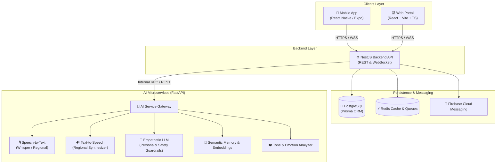
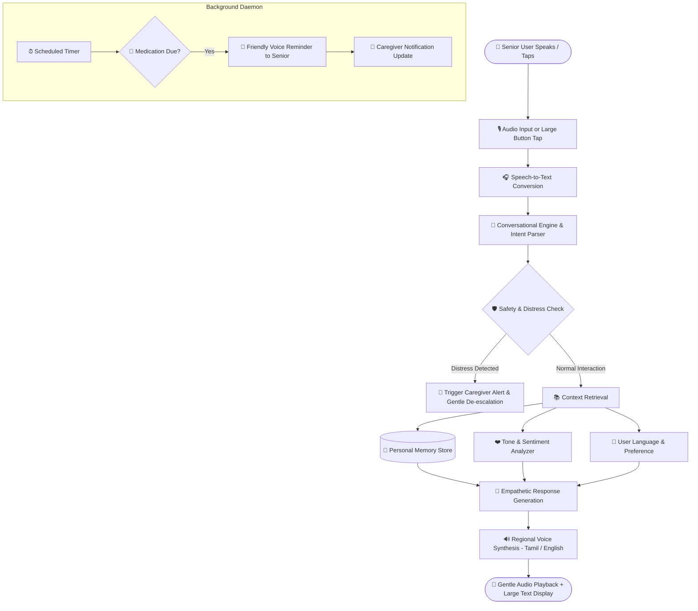

<div align="center">

# 👵 Granny (கிரானி)
### AI-Based Cognitive Gaming & Memory Assistance for the Elderly

[](https://www.typescriptlang.org/)
[](https://reactjs.org/)
[](https://expo.dev/)
[](https://nestjs.com/)
[](https://fastapi.tiangolo.com/)
[](https://www.postgresql.org/)
[](https://www.prisma.io/)
[](https://www.docker.com/)

<p align="center">
  <b>A compassionate, voice-first digital companion designed to empower, entertain, and protect elderly individuals through personalized memory assistance, nostalgic cognitive games, daily routine support, family connections, and empathetic regional voice interaction.</b>
</p>

[Key Features](#-key-features) •
[Architecture](#-application-architecture) •
[Tech Stack](#-technology-stack) •
[Repository Structure](#-project-structure) •
[User Flow](#-core-user-flow) •
[Quick Start](#-quick-start-guide) •
[Roadmap](#-future-scope)

---

</div>

## 📖 Overview

**Granny** bridges the digital divide for seniors. Rather than forcing elderly individuals to navigate complex, overwhelming modern interfaces, Granny offers an empathetic, voice-first environment inspired by familiar memories, nostalgic 80s/90s cognitive games, and natural conversation in regional languages—with dedicated optimization for **Tamil (தமிழ்)** and **English**.

### 🎯 Mission & Vision
* **Dignity & Independence**: Provide proactive daily routine and medication reminders without feeling clinical.
* **Cognitive Vitality**: Keep minds active with adaptive nostalgic brain games that stimulate recall and attention.
* **Warmth & Emotional Comfort**: An attentive companion that listens, detects emotional states, and recalls past life stories.
* **Family Peace of Mind**: Keep trusted caregivers informed with real-time updates and emergency guardrails.

---

## 🌟 Key Features

| Category | Description | Highlights |
| :--- | :--- | :--- |
| 🧠 **Cognitive & Nostalgic Games** | Classic games inspired by the 80s & 90s to stimulate memory, attention, recognition, and logic. | • Adaptive difficulty based on performance<br>• Nostalgic themes recalling youth memories<br>• Persistent score & recall tracking |
| 💭 **Personal Memory Assistant** | Semantic long-term memory that preserves life stories, preferences, and personal milestones. | • Contextual conversational recall<br>• Recalls people, routines, and events<br>• Caregiver-managed memory controls |
| 🎙️ **Multilingual Voice Interaction** | Voice-first natural interaction powered by speech-to-text and low-latency speech synthesis. | • Deep regional optimization for **Tamil** & English<br>• Conversational history retention<br>• Natural conversational cadence |
| 👨‍👩‍👧 **Family & Familiar Voice** | Recognition of enrolled family members' voices and relationships. | • Personalized responses per recognized caller<br>• Connected family circle dashboard<br>• Shared memory & voice journals |
| 💬 **Friendly Companion** | Empathetic conversational partner that listens patiently and converses like a close friend. | • Warm, gentle, non-technical personality<br>• Contextual continuity across sessions<br>• Adaptive speech tone |
| ❤️ **Emotion & Tone Awareness** | Analyzes acoustic and linguistic sentiment (happy, sad, confused, distressed, calm). | • Adjusts tone to comfort or calm the user<br>• Flags confusion or distress patterns<br>• Empathetic response generation |
| 💊 **Health & Routine Assistance** | Non-invasive daily medication schedules, hydration alerts, and activity routines. | • Audio & visual reminders<br>• Schedule confirmation logging<br>• Informational, non-diagnostic guidance |
| 🛡️ **Safety & Guardrails** | Sensitive topic mitigation, distress phrase detection, and safety protocols. | • Real-time emergency trigger alerts<br>• Avoids harmful or confusing medical advice<br>• Encourages reaching out to loved ones |
| ♿ **Elderly-Friendly UX** | High-contrast visual design, massive touch targets (>48px), and zero clutter. | • Simple navigation & large typography<br>• One-tap voice controls<br>• Eliminates modern UI cognitive overload |

---

## 🏗️ Application Architecture

Granny is engineered as an enterprise-grade **full-stack monorepo** coupling high-performance TypeScript web & mobile applications with a robust NestJS orchestrator and a dedicated Python AI microservice.



---

## 🛠️ Technology Stack

```
┌─────────────────┬──────────────────────────────────────────────┬───────────────────────────────────────────┐
│ Domain          │ Technology                                   │ Role / Responsibility                     │
├─────────────────┼──────────────────────────────────────────────┼───────────────────────────────────────────┤
│ Web Client      │ React 18, Vite, TypeScript, Tailwind CSS    │ Senior & Caregiver accessible web portal  │
│ Mobile Client   │ React Native, Expo, TypeScript               │ Senior-optimized handheld application    │
│ Backend Server  │ Node.js, NestJS, TypeScript, WebSockets      │ Core business logic, auth, orchestration  │
│ Database & ORM  │ PostgreSQL, Prisma ORM                       │ Relational data, schemas, migrations      │
│ In-Memory Store │ Redis                                        │ Caching, session states, pub/sub queues   │
│ AI Microservice │ Python 3.10+, FastAPI, Pydantic              │ Real-time voice, emotion, & memory system │
│ Machine Learning│ Whisper STT, TTS Engines, Regional LLMs      │ Tamil/English audio processing & empathy  │
│ Push Alerts     │ Firebase Cloud Messaging (FCM)               │ Urgent medication alarms & family alerts │
│ DevOps          │ Docker, Docker Compose, GitHub Actions       │ Containerized services & CI/CD automation │
└─────────────────┴──────────────────────────────────────────────┴───────────────────────────────────────────┘
```

---

## 📁 Project Structure

```text
granny/
├── apps/
│   ├── web/                     # React + Vite Web Application
│   │   ├── public/              # Static assets & manifest
│   │   ├── src/
│   │   │   ├── assets/          # Icons, illustrations, sound bites
│   │   │   ├── components/      # Common, Navigation, Voice, Games, Accessibility
│   │   │   ├── pages/           # Home, Dashboard, Games, Memory, Companion, Health...
│   │   │   ├── features/        # Feature-driven modules (games, memory, voice, health)
│   │   │   ├── hooks/           # Custom React hooks
│   │   │   ├── services/        # API, Auth, Voice, and Storage service clients
│   │   │   ├── store/           # Global state management (Zustand)
│   │   │   ├── i18n/            # Localization catalogs (en, ta)
│   │   │   ├── App.tsx          # App root component
│   │   │   └── main.tsx         # Entry point
│   │   ├── package.json
│   │   ├── tsconfig.json
│   │   └── vite.config.ts
│   │
│   └── mobile/                  # React Native / Expo Mobile App
│       ├── assets/              # Mobile app icons, splash screens, fonts
│       ├── src/
│       │   ├── components/      # Senior-friendly UI components & large touch targets
│       │   ├── screens/         # Home, Games, Memory, Companion, Health, Settings
│       │   ├── navigation/      # Stack & Tab navigators
│       │   ├── features/        # Voice, memory, companion, reminders
│       │   ├── services/        # Audio streaming, notifications, local storage
│       │   ├── i18n/            # Bilingual dictionaries (en, ta)
│       │   └── store/           # Mobile client state
│       ├── app.json
│       ├── package.json
│       └── tsconfig.json
│
├── backend/                     # NestJS Core API Application
│   ├── src/
│   │   ├── modules/             # Auth, Users, Games, Memory, Conversations, Voice,
│   │   │                        # Family, Health, Reminders, Personalization, Notifications
│   │   ├── common/              # Guards, Middleware, Decorators, Filters, Utils
│   │   ├── config/              # Environment & system configurations
│   │   ├── database/            # Prisma service & database bindings
│   │   ├── app.module.ts        # Root module definition
│   │   └── main.ts              # Server bootstrapper
│   ├── package.json
│   └── tsconfig.json
│
├── ai-services/                 # Python FastAPI AI Microservice
│   ├── app/
│   │   ├── api/                 # Endpoint routers (voice, memory, conversation)
│   │   ├── services/            # Conversation, Memory, Voice, Emotion, Games, Safety
│   │   ├── models/              # Pydantic schemas & internal models
│   │   ├── prompts/             # Senior persona system prompts & guardrail templates
│   │   ├── pipelines/           # STT, TTS, & semantic embedding pipelines
│   │   ├── utils/               # Audio normalization & signal processing
│   │   └── main.py              # FastAPI application initialization
│   ├── tests/                   # AI unit & pipeline evaluations
│   ├── requirements.txt         # Python dependencies
│   └── README.md
│
├── packages/                    # Monorepo Shared Libraries
│   ├── types/                   # Cross-platform shared TypeScript models & DTOs
│   ├── utils/                   # Shared formatters, datetime, & validation helpers
│   ├── api-client/              # Universal API SDK for Web & Mobile
│   └── config/                  # Shared ESLint, TSConfig, & constants
│
├── database/                    # Database Management
│   ├── prisma/
│   │   ├── schema.prisma        # Models: User, Profile, Memory, Conversation, Game...
│   │   └── migrations/          # Version-controlled DB migrations
│   └── seed/
│       └── seed.ts              # Seed scripts with initial demo profiles
│
├── docs/                        # Complete Architecture & System Documentation
│   ├── requirements/            # Functional & Non-functional requirements
│   ├── architecture/            # System, Web, and Mobile architectural deep dives
│   ├── database/                # Database schemas, ERDs, and query optimizations
│   ├── api/                     # REST & WebSocket endpoint specifications
│   ├── ai/                      # Memory systems, Voice pipelines, Safety rules
│   └── user-flows/              # Elderly-centric UX journey maps
│
├── tests/                       # Monorepo Integration & End-to-End Test Suite
├── .env.example                 # Global environment configuration template
├── .gitignore                   # Version control ignore definitions
├── docker-compose.yml           # Multi-container orchestration config
└── package.json                 # Monorepo root with NPM workspace scripts
```

---

## 🔄 Core User Flow



---

## 🌐 Multilingual & Regional Voice (Tamil & English)

Granny prioritizes seamless regional voice interaction:

```
┌───────────────────────────────────────┬───────────────────────────────────────┐
│ 🇬🇧 English Voice Assistant             │ 🇮🇳 Tamil Voice Assistant (தமிழ் குரல்)│
├───────────────────────────────────────┼───────────────────────────────────────┤
│ "Good morning, Kamakshi! It's 8:00 AM.│ "காலை வணக்கம் காமாட்சி அம்மா!        │
│ Did you take your blood pressure pill? │ மணி காலை 8:00. உங்கள் மாத்திரையை     │
│ How are you feeling today?"           │ சாப்பிட்டீர்களா? இன்று உடல் நலம்       │
│                                       │ எப்படி இருக்கிறது?"                   │
└───────────────────────────────────────┴───────────────────────────────────────┘
```

* **Dialect Awareness**: Optimized for natural elderly speech cadence, pauses, and repetition.
* **Cultural Context**: Conversations incorporate familiar idioms, proverbs, and gentle conversational respect (*அம்மா / Amma*).

---

## 🚀 Quick Start Guide

### Prerequisites
* **Node.js**: v18.x or v20.x
* **Python**: v3.10 or v3.11
* **Docker & Docker Compose**
* **Git**

### 1. Clone & Configure Environment

```bash
git clone https://github.com/your-org/granny.git
cd granny

# Copy environment variables
cp .env.example .env
```

### 2. Launch with Docker Compose (Recommended)

Start PostgreSQL, Redis, NestJS Backend, and the FastAPI AI Service in one command:

```bash
docker-compose up --build -d
```

### 3. Local Monorepo Setup (Without Docker)

#### Install Dependencies
```bash
# Install root & workspace dependencies
npm install

# Setup AI Services Python Virtual Environment
cd ai-services
python -m venv venv
source venv/bin/activate    # On Windows: venv\Scripts\activate
pip install -r requirements.txt
cd ..
```

#### Database Setup
```bash
# Generate Prisma Client & Run Migrations
npx prisma migrate dev --schema=database/prisma/schema.prisma

# Seed Initial Sample Data
npx ts-node database/seed/seed.ts
```

#### Run Applications Concurrently
```bash
# Terminal 1: NestJS Backend API
npm run dev:backend

# Terminal 2: AI Microservice
cd ai-services && uvicorn app.main:app --reload --port 8000

# Terminal 3: Web Application
npm run dev:web

# Terminal 4: Mobile Application
npm run dev:mobile
```

* **Web Portal**: `http://localhost:5173`
* **Backend API**: `http://localhost:4000`
* **AI Microservice Docs**: `http://localhost:8000/docs`

---

## 🔮 Future Scope & Roadmap

- [ ] **Expanded Regional Languages**: Hindi, Telugu, Malayalam, Kannada, Bengali.
- [ ] **Advanced Nostalgic Mini-Games**: Regional folk riddles (*விடுகதைகள்*), vintage radio quizzes, family photo jigsaw puzzles.
- [ ] **Speaker Identification**: Biometric voiceprint recognition to greet grandchildren vs. caregivers.
- [ ] **Smart Home & Wearable Sync**: Integration with pulse oximeters, smart pill boxes, and emergency fall detection bands.
- [ ] **Offline Edge Mode**: On-device lightweight voice model for essential reminders without internet connectivity.
- [ ] **Caregiver Family Album**: Voice-narrated digital photo archives annotated with personal memories.

---

## 🛡️ Safety, Privacy & Ethics

* **Health Disclaimer**: Granny provides cognitive engagement and schedule reminders. It **never** provides autonomous medical diagnoses, alters prescription dosages, or replaces qualified clinical professionals.
* **Data Privacy**: Senior memories, voice recordings, and health records are encrypted at rest and in transit. Family access requires explicit elderly or guardian consent.
* **Gentle Boundary Enforcement**: If distress or confusion is detected, Granny gently directs the conversation toward calling trusted family members or medical helplines.

---

## 👥 Contributing & Team

Developed with ❤️ for **Smart India Hackathon (SIH 2026)** to empower our elders through empathetic technology.

Contributions, feature suggestions, and bug reports are welcome! Please review [docs/architecture/system-architecture.md](file:///d:/SIH%202026/Granny/docs/architecture/system-architecture.md) before submitting pull requests.

---

## 📄 License

This project is licensed under the [MIT License](LICENSE).
