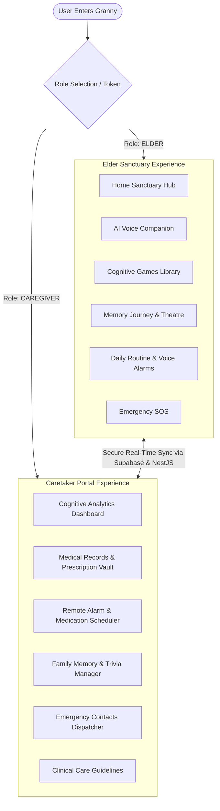
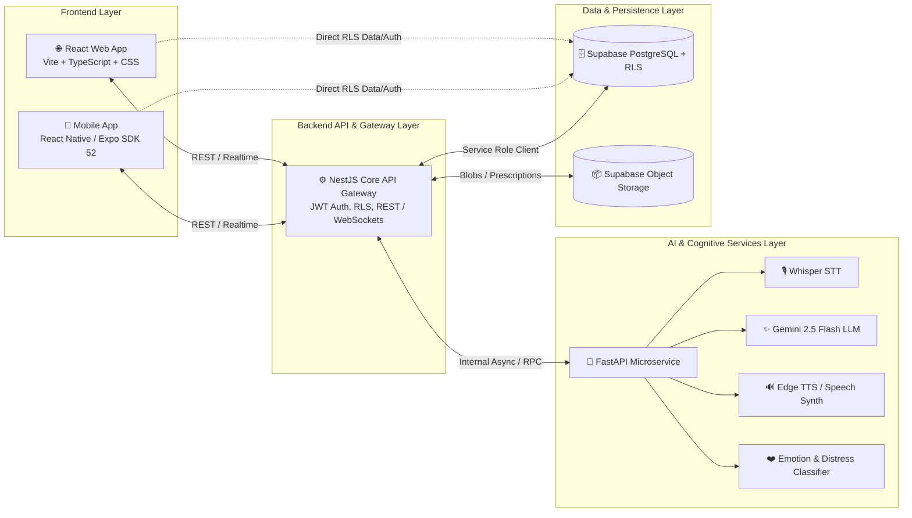
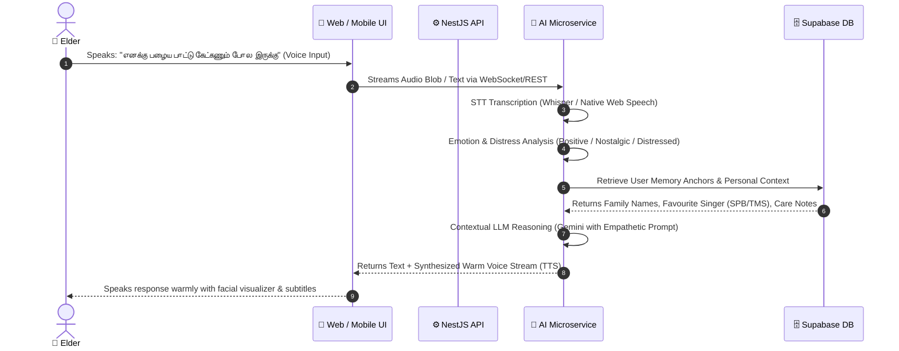
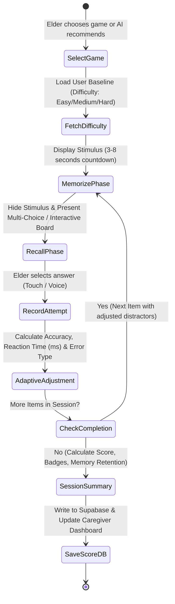
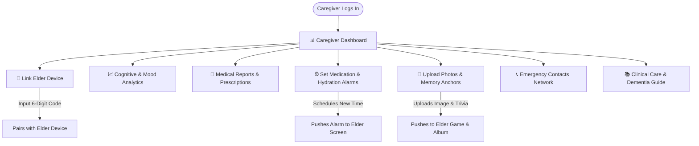
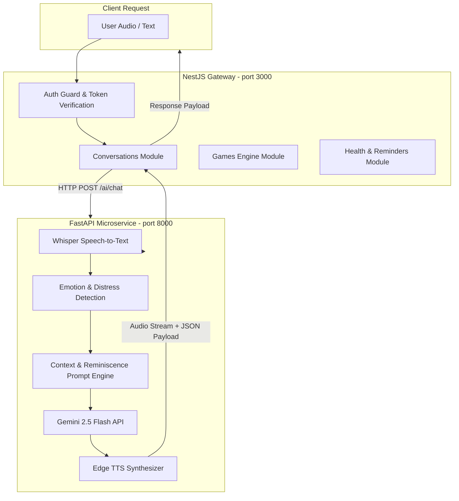
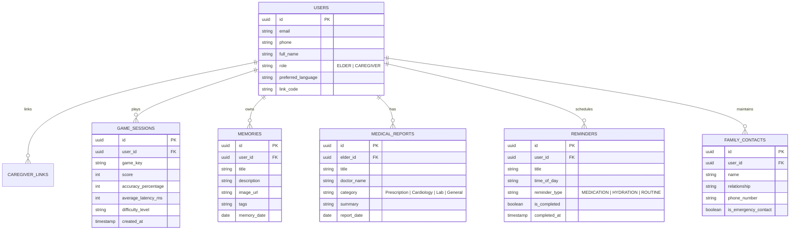

# 🌸 GRANNY — COMPLETE WEB & MOBILE APP SYSTEM FLOW
> **AI-Powered Cognitive Gaming, Nostalgia Reminiscence & Compassionate Elder-Care Platform**
> *Reference Document for Full-Stack Architecture, User Journeys, Screen Flows, AI Pipelines & Data Synchronization*

---

## 📑 TABLE OF CONTENTS
1. [Executive System Overview](#1-executive-system-overview)
2. [Dual Persona Architecture](#2-dual-persona-architecture)
3. [End-to-End System Architecture & Data Pipelines](#3-end-to-end-system-architecture--data-pipelines)
4. [Elder User Flow & Interactive Journeys](#4-elder-user-flow--interactive-journeys)
   - 4.1 Onboarding, Auth & Accessibility Calibration
   - 4.2 Elder Home Sanctuary Hub
   - 4.3 Voice-First AI Companion Engine
   - 4.4 Cognitive Nostalgia Game World (20 Games & Adaptive Engine)
   - 4.5 Memory Journey & Reminiscence Theatre
   - 4.6 Health, Routine & Audio Medication Alarms
   - 4.7 Emergency SOS & Safety De-escalation
5. [Caretaker & Family Circle Portal Flow](#5-caretaker--family-circle-portal-flow)
   - 5.1 Elder-Caregiver Device Pairing
   - 5.2 Caregiver Command Center & Cognitive Analytics
   - 5.3 Medical Reports & Prescription Management
   - 5.4 Remote Alarm & Routine Scheduler
   - 5.5 Shared Family Memory Vault
   - 5.6 Emergency Circle & Priority Dispatch
   - 5.7 Caregiving Insights & Dementia Guidance
6. [Web Application Navigation & State Flow Matrix](#6-web-application-navigation--state-flow-matrix)
7. [Mobile Application (Expo / React Native) Screen Flow](#7-mobile-application-expo--react-native-screen-flow)
8. [AI Microservices & Backend API Interaction Flow](#8-ai-microservices--backend-api-interaction-flow)
9. [Database Schema & Real-Time Sync Flow](#9-database-schema--real-time-sync-flow)

---

## 1. Executive System Overview

**Granny** is a full-stack, multimodal digital health ecosystem created to combat cognitive decline, loneliness, and memory loss among older adults while providing seamless coordination and peace of mind for family caregivers.

### Core Guiding Principle
> *"Don’t make the elderly adapt to the interface. Make the interface adapt to the elderly."*

### Key Architectural Pillars
- **Voice-First & Large-Touch Interaction:** Voice is the primary input method with speech-to-text (STT) and natural text-to-speech (TTS), supported by high-contrast, oversized tactile UI components.
- **Cultural & Nostalgic Grounding:** Games and memory cues draw heavily from South Asian heritage (traditional games like *Pallanguzhi*, *Nondi*, *Paramapadham*, *Kanche*, vintage Kollywood/Carnatic music, and village landmarks).
- **Closed-Loop Adaptive Difficulty Engine:** Dynamically modulates stimulus presentation time, distraction levels, and item quantities based on user response accuracy, latency, and emotional state.
- **Dignified Caregiver Visibility:** Caregivers receive actionable adherence, health logs, and cognitive trends without invasive real-time surveillance.

---

## 2. Dual Persona Architecture

The application enforces a clean separation of concerns between two distinct roles:



---

## 3. End-to-End System Architecture & Data Pipelines



---

## 4. Elder User Flow & Interactive Journeys

### 4.1 Onboarding, Auth & Accessibility Calibration
1. **Entry Point:** Elder launches Web or Mobile application.
2. **Accessibility Check:** Immediate choice of:
   - **Language Toggle:** English (EN) ↔ தமிழ் (Tamil).
   - **Display Mode:** Standard Cream/Sage theme ↔ High-Contrast Dark Mode (`#121212` with golden yellow & emerald accents).
   - **Font Scale:** Normal (1x), Large (1.25x), Extra Large (1.5x).
3. **Frictionless Login:**
   - One-tap quick login for registered elders, or simple phone/email and PIN authentication.
   - Demo mode auto-load for instant accessibility without passwords.

---

### 4.2 Elder Home Sanctuary Hub
- **Time-Aware Salutation:** Dynamically shows *"காலை வணக்கம்"* (Good Morning), *"மதிய வணக்கம்"* (Good Afternoon), or *"மாலை வணக்கம்"* (Good Evening) with current date in traditional and modern formats.
- **Daily Routine Widget:** Shows the next impending task (e.g., *"Morning Blood Pressure Tablet - 8:30 AM"*).
- **Quick-Access Action Grid:**
  - 🗣️ **Talk to Granny (AI Companion)**
  - 🎮 **Play Memory Games (20 Nostalgic Games)**
  - 🖼️ **My Memories & Stories (Memory Journey)**
  - ⏰ **My Daily Medicines & Alarms**
  - 🚨 **Emergency SOS Button (Always Accessible)**

---

### 4.3 Voice-First AI Companion Engine Flow



---

### 4.4 Cognitive Nostalgia Game World (20 Games Library)

The game suite exercises working memory, visual-spatial cognition, pattern recall, executive function, and psychomotor speed.

```
┌────────────────────────────────────────────────────────────────────────────────┐
│                          20 NOSTALGIA-BASED COGNITIVE GAMES                    │
├───────────────────────┬────────────────────────┬───────────────────────────────┤
│ 🏃 GROUP A: OUTDOOR   │ 🎲 GROUP B: INDOOR     │ 🎬 GROUP C: CINEMA & MUSIC    │
├───────────────────────┼────────────────────────┼───────────────────────────────┤
│ 1. Nondi (Hopscotch)  │ 11. Aadu Puli Aattam   │ 17. Vintage Cinema Dialogues  │
│ 2. Kanche (Marbles)   │ 12. Paramapadham       │ 18. MSV & Ilaiyaraaja Match   │
│ 3. Gilli Danda        │ 13. Chathuranga        │ 19. Carnatic Swaram Match     │
│ 4. Pallanguzhi        │ 14. Thayam Rolling     │ 20. Retro Movie Poster Match  │
│ 5. Dhayakattai        │ 15. Pagade Board Path  │                               │
│ 6. Kabaddi Call       │ 16. Card Memory Match  │                               │
│ 7. Kite Flying Wind   │                        │                               │
│ 8. Kho-Kho Spotter    │                        │                               │
│ 9. Bambaram Top Spin  │                        │                               │
│ 10. Tug-of-War Sync   │                        │                               │
└───────────────────────┴────────────────────────┴───────────────────────────────┘
```

#### The Dynamic Closed-Loop Game Session Flow:


---

### 4.5 Memory Journey & Reminiscence Theatre Flow
- **Memory Journey:** Linear chronological album of curated family events, wedding archives, grandchildren photos, and hometown landmarks.
- **Reminiscence Theatre:** Interactive multi-step immersive slideshow that pairs photos with:
  1. *Visual Observation Prompt:* "Look at this photograph from 1982 in Madurai."
  2. *Emotional Memory Question:* "Do you remember who was sitting next to you under the mango tree?"
  3. *Voice Response & Gratification:* Elder replies via voice; AI validates affectionately without punitive grading.

---

### 4.6 Health, Routine & Audio Medication Alarms
- **Medication Schedule:** Clear large-card timeline (Morning, Afternoon, Night).
- **Interactive Check-In:** One-tap *"I Took My Medicine"* button that logs adherence timestamp to the caregiver's portal.
- **Audio Chimes:** Soft, non-alarming classical flute and temple bell chimes rather than shrill emergency sirens.

---

### 4.7 Emergency SOS & Safety De-escalation
- **Trigger:** Elder taps red floating SOS button or speaks emergency trigger words (*"Help"*, *"காப்பாத்துங்க"*, *"நெஞ்சு வலிக்குது"*).
- **Instant Response:**
  1. Instant confirmation pop-up connecting to primary emergency contact (e.g., Son/Daughter phone & doctor).
  2. Background notification push to Caregiver Dashboard.
  3. UI switches to soothing calming breathing card to prevent panic.

---

## 5. Caretaker & Family Circle Portal Flow

The Caretaker portal is an all-in-one command center allowing children, family members, and nurses to remotely oversee and assist their elders.



### Detailed Caretaker Features:
1. **Elder Device Linking (`caretaker_link`):**
   - Elder generates a unique 6-character code (e.g., `ELDER-9482`).
   - Caretaker enters code in their portal to establish encrypted parent-child link.
2. **Cognitive Analytics Hub (`dashboard`):**
   - Game session accuracy rate and weekly completion rate.
   - Mood trend analysis (Positive, Neutral, Melancholic, Anxious) derived from companion interactions.
   - Daily medication compliance streak.
3. **Medical Vault (`caretaker_medical`):**
   - Add doctor prescriptions, lab blood reports, cardiology summaries, and doctor contact numbers.
4. **Remote Medication & Routine Scheduler (`caretaker_alarms`):**
   - Schedule morning tablets, evening walks, eye drops, or meal times.
   - Real-time sync ensures changes reflect instantly on the Elder's mobile/web app.
5. **Memory Anchor Vault (`caretaker_memories`):**
   - Caregiver uploads family photos, labels family members (e.g., *"Granddaughter Ananya at graduation"*), and creates customized trivia for the AI Companion.
6. **Emergency Circle (`caretaker_contacts`):**
   - Manage primary emergency numbers, ambulance hotline, family doctor, and neighborhood emergency contacts.
7. **Caregiver Best Practices Guide (`caretaker_guide`):**
   - Evidence-based techniques for handling Sundowning syndrome, repetitive questions, validation therapy vs. harsh reality orientation.

---

## 6. Web Application Navigation & State Flow Matrix

The Web Application (`apps/web/src/App.tsx`) uses client-side route and state management synced with URL hashes:

| Route Hash | Page Title | Target User Role | Primary Functionality |
|---|---|---|---|
| `#landing` | Landing Sanctuary | Public / Guest | Introduction, SIH feature highlights, live audio teaser, entry selector |
| `#auth` | Authentication | Public | Login / Registration for Elder or Caregiver with language switch |
| `#home` | Elder Home | **ELDER** | Central hub, routine preview, game launcher, voice companion launch |
| `#companion` | AI Companion | **ELDER** | Real-time chat, voice streaming, sentiment feedback, avatar visualizer |
| `#games` | Cognitive Games World | **ELDER** | 20 games catalog with category filters (Outdoor, Indoor, Cinema) |
| `#play` | Active Game Arena | **ELDER** | Memorize → Recall → Adaptive difficulty scoring loop |
| `#theatre` | Reminiscence Theatre | **ELDER** | Guided step-by-step nostalgic photo immersion |
| `#memory` | Memory Journey | **ELDER** | Family timeline, nostalgic story cards, audio memory triggers |
| `#health` | Elder Health & Alarms | **ELDER** | Medicine checklist, daily logs, one-tap intake confirmation |
| `#settings` | Accessibility Settings | **ELDER / CAREGIVER** | Font scaling (1x–1.5x), High contrast toggle, Language switch |
| `#dashboard` | Caretaker Dashboard | **CAREGIVER** | Cognitive score cards, mood analytics, adherence charts |
| `#caretaker_alarms` | Remote Alarms | **CAREGIVER** | Add/edit/delete scheduled medication and routine alarms |
| `#caretaker_medical` | Medical Records Vault | **CAREGIVER** | Prescriptions, doctor notes, lab records management |
| `#caretaker_memories` | Family Memory Manager | **CAREGIVER** | Add family photos, tags, and memory story prompts |
| `#caretaker_contacts` | Emergency Network | **CAREGIVER** | Configure emergency contacts, doctors, priority order |
| `#caretaker_link` | Elder Pairing | **CAREGIVER** | Generate & connect 6-digit sync link codes |
| `#caretaker_guide` | Caregiving Knowledge | **CAREGIVER** | Clinical eldercare guides, de-escalation tips, nutrition |

---

## 7. Mobile Application (Expo / React Native) Screen Flow

The Mobile App (`apps/mobile/App.tsx`) provides high-performance native capabilities with bottom navigation tabs tailored to the authenticated role:

```
┌────────────────────────────────────────────────────────────────────────┐
│                        MOBILE APP SCREEN FLOW                          │
├────────────────────────────────────────────────────────────────────────┤
│ 1. AuthScreen: Clean PIN/Credentials, Language Picker (தமிழ்/EN)       │
│                                                                        │
│ IF ROLE == 'ELDER':                                                    │
│ ┌────────────────────────────────────────────────────────────────────┐ │
│ │ Top Bar: 🌸 Granny Logo | Elder Space Pill | Lang Switch | Exit    │ │
│ ├────────────────────────────────────────────────────────────────────┤ │
│ │ Active Tab View:                                                   │ │
│ │  ├─ HomeScreen: Quick Companion CTA, Next Pill, Spotlight Game, SOS│ │
│ │  ├─ CompanionScreen: Big mic button, speech bubbles, TTS audio      │ │
│ │  ├─ GamesScreen: 20 games list + FlagshipGame engine arena         │ │
│ │  └─ RemindersScreen: Big checkbox medication schedule               │ │
│ ├────────────────────────────────────────────────────────────────────┤ │
│ │ Bottom Navigation: [🏠 Home]  [🗣️ Companion]  [🎮 Games]  [⏰ Reminders]│ │
│ └────────────────────────────────────────────────────────────────────┘ │
│                                                                        │
│ IF ROLE == 'CAREGIVER':                                                │
│ ┌────────────────────────────────────────────────────────────────────┐ │
│ │ CaregiverScreen: Tabbed overview of Elders, Cognitive Scores,      │ │
│ │ Prescriptions, Alarms Sync, and Emergency Contact Manager          │ │
│ └────────────────────────────────────────────────────────────────────┘ │
└────────────────────────────────────────────────────────────────────────┘
```

---

## 8. AI Microservices & Backend API Interaction Flow



---

## 9. Database Schema & Real-Time Sync Flow

The Supabase PostgreSQL database enforces strict Row-Level Security (RLS) while facilitating instant family-elder synchronization:



---

## 10. Summary & Verification Checklist

- [x] **Complete Dual Persona Separation:** Elder Sanctuary mode vs Caretaker Portal.
- [x] **Voice & Accessibility First:** Dual language support (Tamil & English), high-contrast palette, scalable typography.
- [x] **20 Nostalgic Cognitive Games:** Fully cataloged across outdoor, indoor, and retro cinema categories with an adaptive scoring loop.
- [x] **Family Circle & Caretaker Toolkit:** Complete CRUD flows for medical records, alarms, family memory anchors, and emergency dispatch.
- [x] **Cross-Platform Parity:** Detailed screen-by-screen architectural alignment between React Web and Expo Mobile.

*Created for Granny AI Cognitive System — SIH 2026 Reference Specification.*
